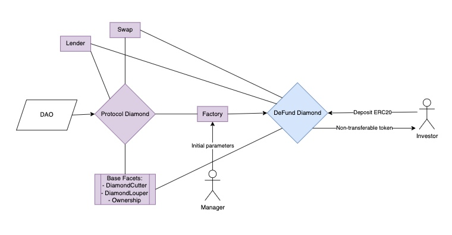
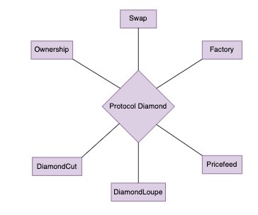

# Fungi Protocol

## General
Fungi’s mission is to bring the global asset management industry on-chain. We aim to use blockchain technology to create new solutions that are more transparent, efficient, and accessible than traditional asset management practices, democratizing access to DeFi and breaking down the barriers of complexity. 
Through the application of smart contracts and the integration with decentralized protocols, Fungi can automate asset management processes cutting out intermediaries and fees, enable greater control and ownership of assets by investors, and eliminate fraud entirely.
The investment vehicles created by Fungi to push this change forward are called DeFunds: Decentralized Investment Funds.

## Architecture<a name="architecture"></a>

The Fungi Protocol is built using the EIP-2535 (Multi-facet Proxy) standard. The contract logic is composed of one central **diamond** contract which is used to store all of the facets, and among these facets there is a factory which is used to create new DeFunds which are themselves diamonds.

All business logic is built using **facet** contracts which live in `src/Facets`.

For more information on EIP-2535 you can view the entire EIP [here](https://eips.ethereum.org/EIPS/eip-2535).

---

### Contract Flow<a name="contract-flow"></a>

One example of use would be a manager creating a DeFund and build a portfolio. The manager would then develop a strategy to get the most out of the deposited assets received either from himself or other investors. The assets could then be used to stake, lend, or provide liquidity to a DEX.



---

### Protocol Structure<a name="protocol-structure"></a>

The Fungi Protocol diamond holds all the facets required to create a DeFund and provide the necessary functionality to manage the assets. It is expected that the protocol will continually add more facets to provide more functionality and allow for more complex strategies.



## Repository Structure<a name="repository-structure"></a>

```
contracts
│ README.md                   // you are here
│ ...                         // setup and development configuration files
│
├─── helpers                   // helper functions
├─── deploy                   // deployment scripts
├─── diamondABI               // Diamond ABI definition
├─── scripts                  // scripts containing sample calls for demonstration
│
├─── src                      // the contract code
│   ├── Facets                // service facets
│   ├── Interfaces            // interface definitions
│   └── Libraries             // library definitions
|   └── upgradeInitializers   // Diamond contract
|   └── Diamond.sol           // Diamond contract
│
└─── test                     // contract unit tests
    ├─── facets               // facet tests
    └─── utils                // testing utility functions
```

## Dependencies
   - Install [foundry](https://book.getfoundry.sh)
   - Install [string-utils](https://github.com/Arachnid/solidity-stringutils)
   - Install [solhint](https://github.com/protofire/solhint)

## Installation <a name="installation"></a>
  - clone the repo 
    ```bash
       $ git clone https://github.com/FungiProject/FungiProtocol.git
    ```
  - install all of the dependencies via 
    ```bash
       $ forge install
    ```

  Make sure to copy `.env.example` to `.env` and fill out the missing values. Tests might fail with missing environment variables if some of the variables are blank.
## Testing
  To run all of the tests use the command
  ```bash
     $ forge test --ffi --match-path test/DiamondTests.t.sol
  ```
## Deployment
To deploy diamond with standard facets, create .env, start anvil and use command
  ```bash
     $ forge script script/deployDiamond.s.sol:DeployScript --fork-url http://localhost:8545 --broadcast --ffi
  ```
Or deploy to testnet, for example
  ```bash
     $ forge script script/deployDiamond.s.sol:DeployScript --rpc-url $SEPOLIA_RPC_URL --broadcast --verify -vvvv --ffi

  ```
## Contributing
  Feel free to create issues and contribute by cloning the repo and adding your changes
  to your own branch. 

## More Information<a name="more-information"></a>

- [Website](https://www.fungiprotocol.xyz/)
- [General Documentation](https://docs.fungiprotocol.xyz/)

